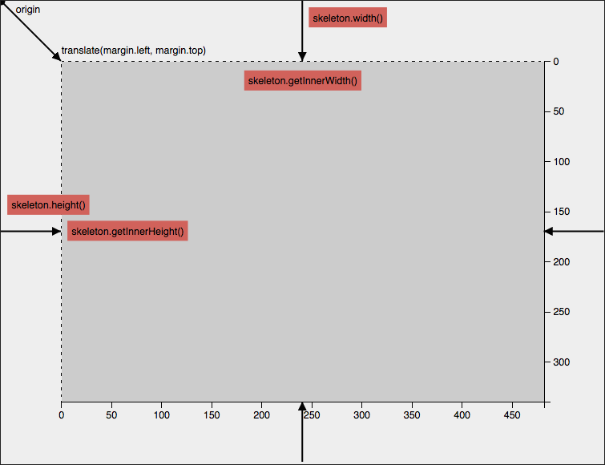

## d3Kit

[](http://travis-ci.org/twitter/d3kit)

**d3Kit** is a set of tools to speed [D3](https://github.com/mbostock/d3) related project development.

<p align="center">
  <a href="http://bl.ocks.org/kristw/7eef5cb21f3dfc1c0a4c" style="width:100%;">
    
  </a>
</p>

It is a lightweight library (~8KB, minified) to help you do the basic groundwork tasks you need when building visualizations with d3.
d3Kit features include, but are not limited to:

* Setup ```<svg>``` according to d3's [margin convention](http://bl.ocks.org/mbostock/3019563), make it support auto-resizing and add other convenient functions. We called it a "Skeleton" for your visualization.
* Help you create reusable component.
* Help you create reusable subcomponent (a.k.a. Chartlet).
* and many more...

Here are a few examples of d3Kit in action:
* [Dot in a box](http://bl.ocks.org/treboresque/f839966214cf66627df6)
* [Bubble Chart](http://bl.ocks.org/kristw/75999459f1a34e05d580)
* [Reusable Bubble Chart](http://bl.ocks.org/kristw/d8b15dd09a4c3510621c)
* [Circle Chartlet](http://bl.ocks.org/treboresque/0f01e42fb3c9268d7105)

For more examples, [check out our gallery](https://github.com/twitter/d3kit/wiki/Gallery).

Want to learn more? [See the wiki](https://github.com/twitter/d3kit/wiki) or [API Reference](https://github.com/twitter/d3kit/wiki/API-reference)

### Can't wait to try it?

```
bower install d3kit
```

or

```
npm install d3kit
```

### Authors

* Robert Harris [@trebor](https://twitter.com/trebor)
* Krist Wongsuphasawat [@kristw](https://twitter.com/kristw)
